# 📈 Retail Demand Forecasting using Statistical, Machine Learning, and Deep Learning Models

**Final Major Project — Celebal Technologies Data Science Internship**

This project builds an end-to-end retail demand forecasting pipeline that predicts future daily sales for 50 products across 10 stores, using five years of historical sales data. Statistical, machine learning, and deep learning approaches are developed and compared to identify the most effective forecasting method.

---

## 📌 Problem Statement

Demand forecasting is a critical task in retail, helping businesses plan inventory, reduce stockouts, minimize excess stock, and make better decisions. This project uses historical daily sales data to forecast the next 3 months of sales for every store-item combination.

**Dataset:** [Store Item Demand Forecasting Challenge — Kaggle](https://www.kaggle.com/c/demand-forecasting-kernels-only)

- **Train set:** 913,000 daily records (Jan 2013 – Dec 2017)
- **Test set:** 45,000 records to forecast (Jan 2018 – Mar 2018)
- **Scope:** 10 stores × 50 items = 500 individual time series
- No missing values or duplicates in either dataset

---

## 🧠 Approach

The notebook follows a complete, structured data science workflow:

1. **Business & Data Understanding** — shape, schema, and data quality checks
2. **Exploratory Data Analysis (EDA)** — trend, seasonality, and distribution analysis
3. **Time Series Analysis** — seasonal decomposition, ADF stationarity test, ACF/PACF
4. **Feature Engineering** — calendar features, lag features (1/7/30-day), rolling means (7/30-day)
5. **Modeling** — Naive Baseline, SARIMA, LightGBM, LSTM
6. **Model Evaluation** — MAE, RMSE, SMAPE comparison across all models
7. **Recursive Multi-step Forecasting** — walk-forward prediction for the 3-month test horizon
8. **Model Persistence** — trained models and scalers saved with `joblib`
9. **Final Submission** — predictions generated and submitted to Kaggle

---

## 🔍 Exploratory Data Analysis

**Total daily sales showed a steady upward trend from 2013–2017 with a strong yearly seasonal pattern.**

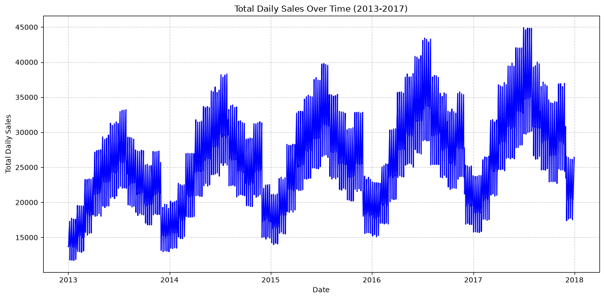

**Sales are right-skewed, with most daily values between 20 and 70 units.**

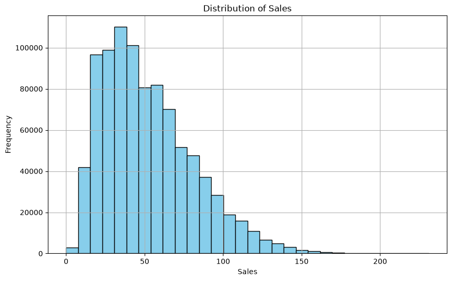

**Monthly trend confirms seasonality — sales peak around July and dip in December/January.**

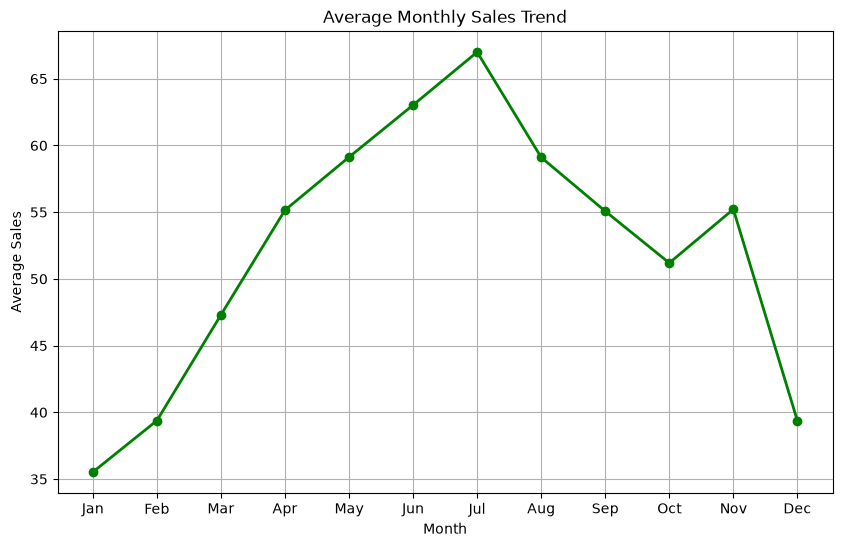

**Yearly average sales increased consistently, indicating steady business growth.**

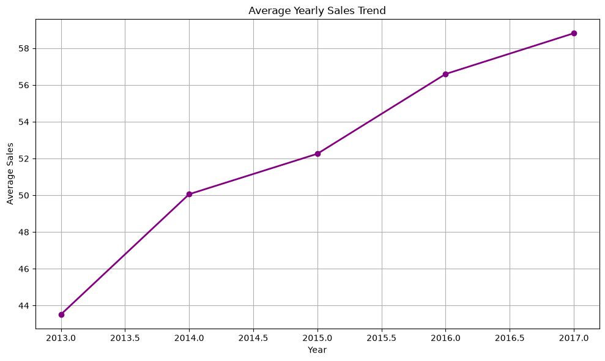

**Sales vary meaningfully by store...**

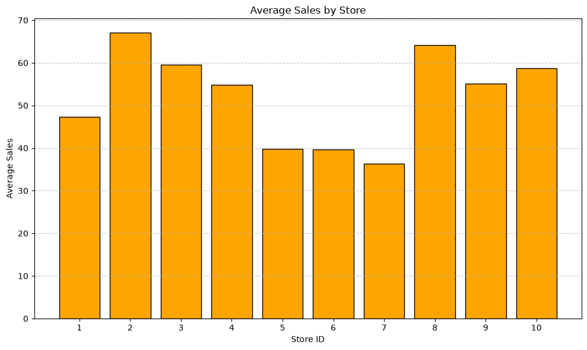

**...and by item, showing clear differences in product popularity.**

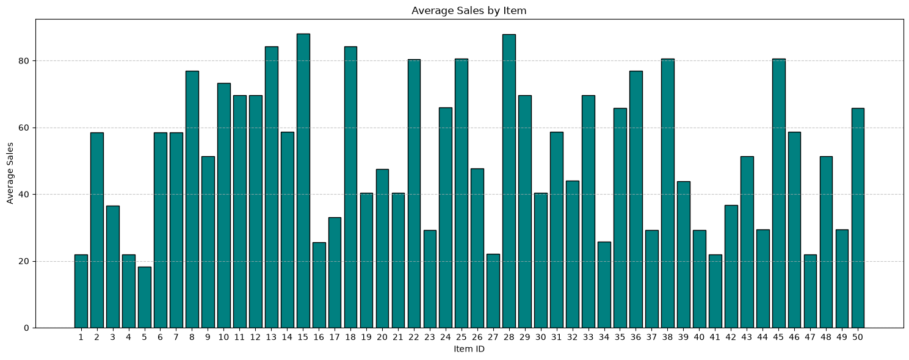

---

## ⏱️ Time Series Diagnostics

**Seasonal decomposition confirms a rising trend and strong annual seasonality, with residuals fluctuating around zero.**

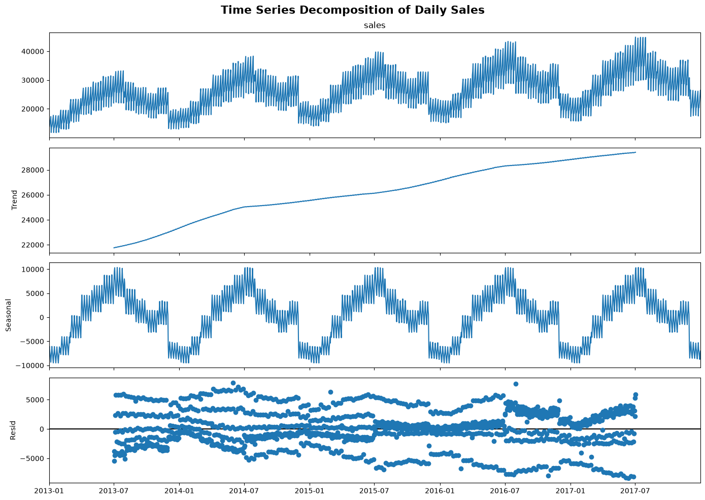

**ACF and PACF plots show strong autocorrelation, supporting the use of lag-based and SARIMA-style models.**

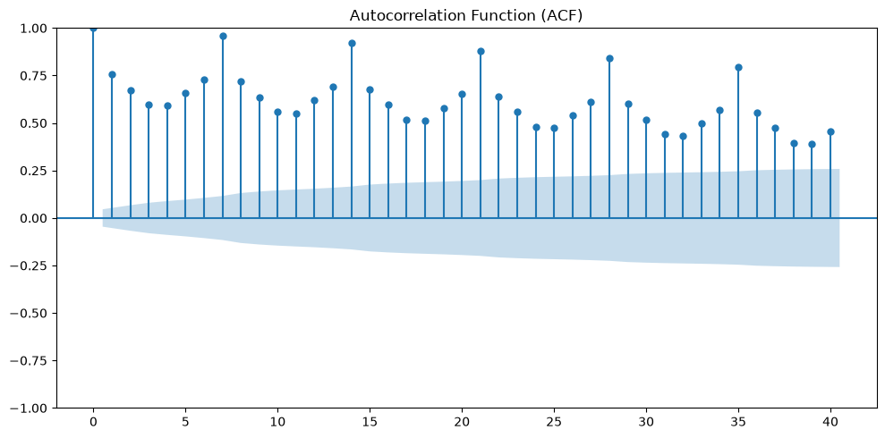
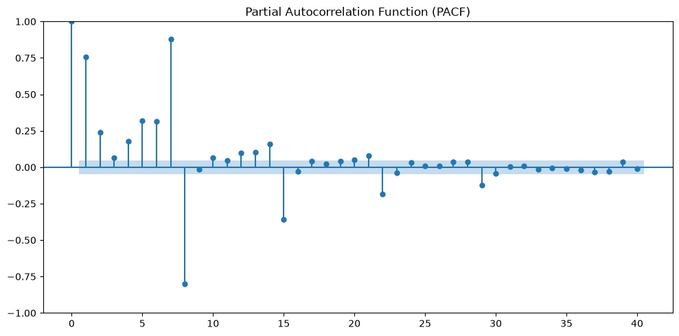

---

## 🏗️ Feature Engineering

Engineered features used across the ML/DL models:

| Category | Features |
|---|---|
| Calendar | `year`, `month`, `day`, `day_of_week`, `week_of_year`, `quarter`, `is_weekend` |
| Lag | `lag_1`, `lag_7`, `lag_30` |
| Rolling statistics | `rolling_mean_7`, `rolling_mean_30` |

**Feature importance from the LightGBM model — rolling means and lag features dominate, confirming that recent historical sales are the strongest predictors.**

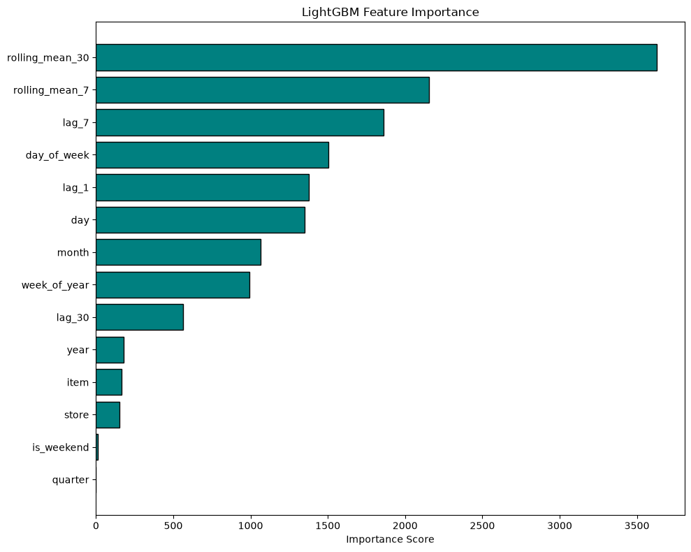

---

## 🤖 Models & Results

Four forecasting approaches were trained and evaluated on a chronological validation split (last 3 months of training data held out):

| Model | MAE | RMSE | SMAPE |
|---|---:|---:|---:|
| Naive Forecast (baseline) | 10.76 | 14.62 | 21.54% |
| SARIMA | 3918.33* | 5577.56* | 14.22% |
| **LightGBM (final model)** | 5.9152 | 7.6509 | **12.47%** |
| LSTM | 6.39 | 8.33 | 13.34% |

*\*SARIMA was trained on aggregated total daily sales rather than per store-item series, so its MAE/RMSE are on a different scale and not directly comparable — SMAPE is the fair comparison metric across all models.*

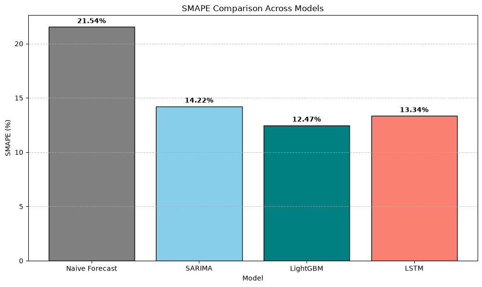

**🏆 LightGBM achieved the lowest SMAPE and was selected as the final forecasting model.**

Forecasts for the test period were generated using **recursive multi-step forecasting** — predictions are made one day at a time, and lag/rolling features are dynamically updated with each new prediction before forecasting the next day. This avoids data leakage while still producing a full 3-month forecast.

---

## 🏆 Kaggle Submission

The final LightGBM-based submission scored:

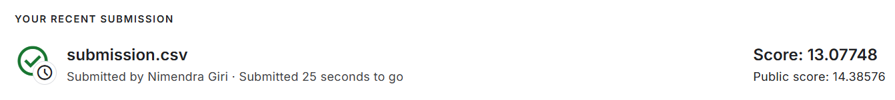

- **Private Score:** 13.07748
- **Public Score:** 14.38576

---

## 🗂️ Repository Structure

```
Final_Major_Project_Demand_Forecasting/
│
├── Demand_Forecasting_Celebal.ipynb   # Full notebook (EDA → modeling → submission)
├── README.md                          # Project documentation (this file)
├── requirements.txt                   # Python dependencies
├── submission.csv                     # Final Kaggle submission file
├── images/                            # Plots and result screenshots used in this README
├── models/                            # Saved trained models (LightGBM, SARIMA, LSTM) and scalers
└── data/                              # train.csv, test.csv (from Kaggle)
```

> **Note:** The `data/` folder is included here for convenience, but if your repo has file-size limits or you'd rather not redistribute competition data, you can remove it and instead direct users to download `train.csv` and `test.csv` from the [competition page](https://www.kaggle.com/c/demand-forecasting-kernels-only/data).
>
> The `.venv/` (virtual environment) folder should **not** be uploaded — see the note below.

---

## ⚙️ Tech Stack

- **Language:** Python
- **Data Handling:** pandas, NumPy
- **Visualization:** Matplotlib
- **Statistical Modeling:** statsmodels (SARIMA, seasonal decomposition, ADF test, ACF/PACF)
- **Machine Learning:** LightGBM, scikit-learn
- **Deep Learning:** TensorFlow / Keras (LSTM)
- **Model Persistence:** joblib

---

## 🚀 How to Run

1. Clone this repository and navigate to this project folder:
   ```bash
   git clone https://github.com/nimendragiri-lgtm/Nimendra_Giri_JECRC_CEI_DS.git
   cd Nimendra_Giri_JECRC_CEI_DS/Final_Major_Project_Demand_Forecasting
   ```
2. Download the dataset from [Kaggle](https://www.kaggle.com/c/demand-forecasting-kernels-only/data) into a `data/` folder here.
3. Install dependencies:
   ```bash
   pip install pandas numpy matplotlib statsmodels lightgbm scikit-learn tensorflow joblib
   ```
4. Run `Demand_Forecasting_Celebal.ipynb` cell by cell in Jupyter Notebook / JupyterLab.

---

## 🔮 Future Scope

- Add longer lag features (`lag_90`, `lag_180`, `lag_365`)
- Add exponential moving averages and rolling standard deviation features
- Hyperparameter tuning for LightGBM using Optuna / RandomizedSearchCV
- Incorporate holiday and promotional data as external variables
- Use `TimeSeriesSplit` cross-validation for more robust evaluation
- Deploy the final model as an API using FastAPI

---

## ✅ Conclusion

This project delivers a complete demand forecasting pipeline — from raw sales data to a deployable model — covering statistical, machine learning, and deep learning techniques. **LightGBM was selected as the final model**, achieving the lowest validation SMAPE among all approaches, and recursive multi-step forecasting was used to generate realistic, leakage-free predictions for the competition submission.

---

## 🙋 Author

**Nimendra Giri**
Data Science Intern — Celebal Technologies
[GitHub Profile](https://github.com/nimendragiri-lgtm)
